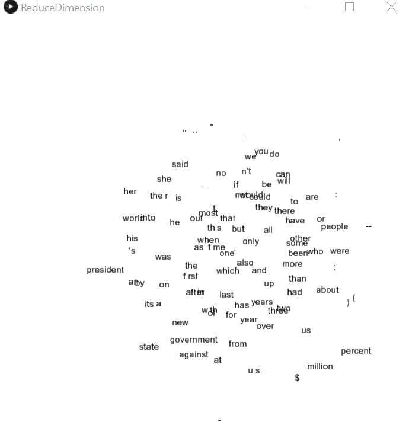

# Reduce Dimensionality of High Dimensional Vectors
To Run:
```
rd.bat
```
Result:
300-D word vectors are reduced to graphically representable 2-D vectors.



# Entropy
Experimenting with entropy and information theory.  
Reference: https://en.wikipedia.org/wiki/Entropy

## Shannon Entropy (H):
- Shows how "random" or "compressed" the data is  
- Calculation:  
  
- Example Run:
```
$> compare_entropy.py

Compare Shannon Entropy (H) of .bmp, .jpg, and random files
Expected Result: H_bmp < H_jpg < H_random

Entropy for .bmp file: 0.40725679430490014
Entropy for .jpg file: 0.9558639704451859
Entropy for random text: 0.9984971607415577

```
